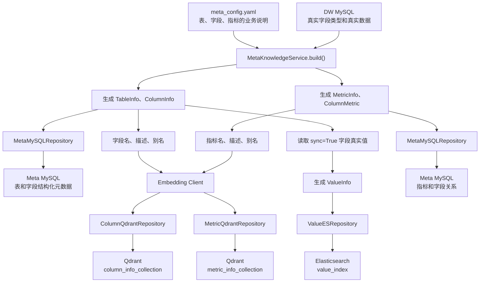

# MetaKnowledgeService 完整数据流程

## 1. 文档目标

本文档描述 `MetaKnowledgeService` 如何把人工维护的业务配置与 DW MySQL
中的真实数据库信息组合起来，并分别写入 Meta MySQL、Qdrant 和
Elasticsearch。

`MetaKnowledgeService` 是元数据知识库的业务编排层。它不负责建立数据库
连接，也不直接编写数据库底层操作，而是决定各个 Repository 应该按照什么
顺序协作。

## 2. 完整流程图



## 3. 两个原始数据来源

### 3.1 meta_config.yaml

`meta_config.yaml` 是人工维护的业务元数据配置，主要提供：

- 表的业务角色和业务描述；
- 字段的角色、描述、别名和同步策略；
- 指标的名称、描述、别名和相关字段。

它描述的是业务语义，不负责提供 MySQL 字段的真实技术类型和真实数据。

### 3.2 DW MySQL

DW MySQL 是数据仓库事实来源，主要提供：

- 数据库中真实存在的表和字段；
- 字段当前真实类型；
- 字段中的真实示例值；
- 允许同步到 Elasticsearch 的字段去重值。

因此，`ColumnInfo` 是 YAML 业务语义和 DW 技术事实合并后的结果。

## 4. 表和字段构建链路

### 4.1 生成业务实体

Service 遍历 `meta_config.tables`，先生成 `TableInfo`，再通过
`DWMySQLRepository` 查询字段类型和示例值，最终生成 `ColumnInfo`。

```text
YAML 表配置
    +
DW 字段类型和示例值
    ↓
TableInfo / ColumnInfo
```

`ColumnInfo` 各字段来源如下：

| 字段 | 来源 |
| --- | --- |
| `id` | Service 使用“表名.字段名”拼接 |
| `name` | meta_config.yaml |
| `type` | DW MySQL |
| `role` | meta_config.yaml |
| `examples` | DW MySQL |
| `description` | meta_config.yaml |
| `alias` | meta_config.yaml |
| `table_id` | 当前 YAML 表名 |

### 4.2 写入 Meta MySQL

`TableInfo` 和 `ColumnInfo` 在同一个事务中交给
`MetaMySQLRepository` 保存：

```text
TableInfo  ──→ table_info
ColumnInfo ──→ column_info
```

Meta MySQL 保存权威、结构化的元数据，后续可以根据字段 ID 精确查询字段、
所属表、主键、外键和其他业务属性。

## 5. 字段向量索引链路

一个字段会拆成多个语义检索入口：

- 字段名称；
- 字段描述；
- 字段的每一个别名。

例如 `order_amount` 字段可能生成以下文本：

```text
order_amount
订单金额
销售额
收入
```

每段文本分别通过 Embedding Client 转换成向量，但它们携带的 payload 都是
同一个完整 `ColumnInfo`。

```text
字段名、描述、别名
        ↓
Embedding Client
        ↓
字段向量
        ↓
ColumnQdrantRepository.upsert()
        ↓
column_info_collection
```

这样用户即使没有说出数据库字段名，也可以通过“销售额”等自然语言召回
`fact_order.order_amount`。

## 6. 字段真实值索引链路

Service 根据 `meta_config.yaml` 中的 `sync` 判断哪些字段需要同步真实值。

适合同步的字段通常是：

- 地区；
- 品牌；
- 商品品类；
- 会员等级；
- 订单状态。

不适合同步的字段通常是高基数 ID、金额和连续数值。

对于 `sync=True` 的字段，Service 从 DW MySQL 查询真实去重值，并把每个值
转换成 `ValueInfo`：

```python
ValueInfo(
    id="dim_region.region_name.华东",
    value="华东",
    column_id="dim_region.region_name",
)
```

完整过程：

```text
sync=True 的 ColumnInfo
        ↓
DWMySQLRepository.get_column_values()
        ↓
ValueInfo
        ↓
ValueESRepository.index()
        ↓
Elasticsearch value_index
```

后续用户输入“华东”时，系统可以搜索到它属于
`dim_region.region_name` 字段。

## 7. 指标结构化元数据链路

Service 遍历 `meta_config.metrics`，为每个指标生成：

- `MetricInfo`：描述指标本身；
- `ColumnMetric`：描述指标依赖哪个字段。

例如：

```text
GMV
  ↓
fact_order.order_amount
```

对应实体：

```python
MetricInfo(
    id="GMV",
    name="GMV",
    description="所有订单的成交金额总和",
    relevant_columns=["fact_order.order_amount"],
    alias=["成交总额", "订单总额"],
)

ColumnMetric(
    column_id="fact_order.order_amount",
    metric_id="GMV",
)
```

两类实体在同一个事务中写入 Meta MySQL：

```text
MetricInfo  ───→ metric_info
ColumnMetric ──→ column_metric
```

## 8. 指标向量索引链路

一个指标同样会拆成多个语义检索入口：

- 指标名称；
- 指标描述；
- 指标的每一个别名。

例如 GMV 可能生成：

```text
GMV
所有订单的成交金额总和
成交总额
订单总额
```

完整过程：

```text
指标名、描述、别名
        ↓
Embedding Client
        ↓
指标向量
        ↓
MetricQdrantRepository.upsert()
        ↓
metric_info_collection
```

用户说“成交总额”时，系统可以通过语义检索召回 GMV，再根据
`relevant_columns` 找到相关 DW 字段。

## 9. build() 的执行顺序

`MetaKnowledgeService.build()` 是整个构建流程的总入口，执行顺序如下：

```text
1. 使用 OmegaConf 读取 meta_config.yaml
2. 转换成 MetaConfig dataclass
3. 构建表和字段结构化元数据
4. 构建字段 Qdrant 向量索引
5. 构建字段真实值 Elasticsearch 索引
6. 构建指标和字段依赖关系
7. 构建指标 Qdrant 向量索引
```

对应方法：

```text
build()
├── _save_tables_to_meta_db()
├── _save_column_info_to_qdrant()
├── _save_value_info_to_es()
├── _save_metrics_to_meta_db()
└── _save_metrics_to_qdrant()
```

表字段链路和指标链路都允许为空，因此可以只构建表字段，也可以只构建指标。

## 10. 最终产物

根据当前 `conf/meta_config.yaml`，构建完成后应得到：

```text
Meta MySQL
├── table_info：表结构化元数据
├── column_info：字段结构化元数据
├── metric_info：指标结构化元数据
└── column_metric：指标与字段关系

Qdrant
├── column_info_collection：字段语义向量
└── metric_info_collection：指标语义向量

Elasticsearch
└── value_index：字段真实业务值
```

## 11. 各层职责边界

```text
MetaConfig
└── 定义人工维护的业务语义

Entities
└── 定义 Service 内部统一使用的业务对象

MetaKnowledgeService
└── 决定数据如何组合以及各步骤的执行顺序

Repositories
└── 负责具体数据库或检索系统的读写

Client Managers
└── 负责客户端连接的创建、复用和关闭
```

Service 不应直接拼接底层数据库连接，也不应把 ORM、Qdrant Point 或
Elasticsearch Hit 暴露给上层。它只使用业务实体和 Repository 提供的操作，
从而保持各层边界清晰。
